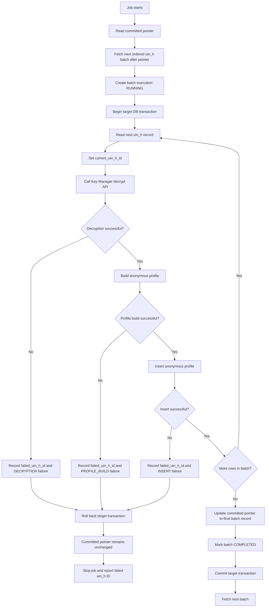

# Anonymous Profile Rebuild Batch Design

## Purpose

This document defines a resumable, transactional batch design for the anonymous-profile rebuild job.

The job reads encrypted history rows from `idrepo.uin_h`, decrypts each row through Key Manager, builds an anonymous profile, and inserts it into the target `idrepo.anonymous_profile` table.

The design ensures that:

- Processing happens in bounded batches.
- A batch is committed only if every record in it succeeds.
- A failure rolls back all target inserts for that batch.
- Restarting the job resumes from the last fully successful batch.
- The exact failing `uin_h` record ID is retained for diagnosis.
- `oldProfile` is derived from the previous history entry for the same `uin_ref_id`.

## Terminology

| Term | Meaning |
| --- | --- |
| Source record | A row from `idrepo.uin_h`. |
| Source record ID | The immutable ID of the `uin_h` row, referred to as `uin_h.id` in this document. |
| Batch | A configurable set of source records, initially targeted at 1,000 rows. |
| Committed pointer | The source record ID of the final record in the last completely committed batch. |
| In-batch pointer | The source record ID currently being processed in the active batch. |
| Failed pointer | The source record ID that caused the batch to fail. |
| Checkpoint | The durable storage of the committed pointer. |

## Source Ordering and Cursor

The job must process `uin_h` deterministically.

The preferred ordering is:

```sql
ORDER BY uin_ref_id ASC, cr_dtimes ASC, id ASC
```

`id` is the final tie-breaker so records with the same `uin_ref_id` and `eff_dtimes` are still processed in a stable order.

The committed checkpoint must store enough cursor information to resume correctly:

```text
last_successful_uin_h_id
last_successful_uin_ref_id
last_successful_cr_dtimes
```

The next batch is fetched with keyset pagination, not `OFFSET`.

```sql
SELECT id, uin_ref_id, cr_dtimes, reg_id, uin_data
FROM idrepo.uin_h
WHERE COALESCE(is_deleted, FALSE) = FALSE
  AND (
       uin_ref_id > :lastUinRefId
       OR (
           uin_ref_id = :lastUinRefId
           AND (
                cr_dtimes > :lastCreatedDateTime
                OR (
                    cr_dtimes = :lastCreatedDateTime
                    AND id > :lastUinHistoryId
                )
           )
       )
  )
ORDER BY uin_ref_id ASC, cr_dtimes ASC, id ASC
LIMIT :batchSize;
```

The implementation must use the real source-history primary key and real column names after confirming the `uin_h` schema.

## Pointers

### Committed pointer

The committed pointer is the authoritative restart position.

- It points to the final `uin_h` record in the last successfully committed batch.
- It is updated only within the same transaction as all anonymous-profile inserts for that batch.
- It is never updated for a partially processed or failed batch.
- After a system restart, the job fetches records strictly after this pointer.

### In-batch pointer

The in-batch pointer is operational state for the currently executing batch.

- Before processing each row, set `current_uin_h_id` to that row’s ID.
- It makes progress observable while a batch is running.
- It must not be used as the restart position because an incomplete batch is rolled back.

### Failed pointer

On a failure, retain the failing source record ID.

```text
failed_uin_h_id = current_uin_h_id
```

The failure record must also retain the batch start cursor, failure stage, timestamp, and error message.

## Batch Execution Flow



## Transaction Rules

For every batch, use one target-database transaction.

Within that transaction:

1. Insert every generated anonymous profile for the batch.
2. Update the committed checkpoint to the final source record in that batch.
3. Mark the batch execution as completed, if batch execution state is stored in the same target database.

Commit only after all three operations succeed.

If any record fails during decryption, profile construction, or insertion:

1. Capture the failed source record ID and failure details.
2. Roll back the target transaction.
3. Do not move the committed pointer.
4. Stop the job and return a failure result.

The next run retries the entire failed batch from the committed pointer.

## Failure Audit

A separate failure/audit record is needed because the main batch transaction is rolled back.

Suggested fields:

```text
batch_execution_id
status
batch_start_uin_h_id
batch_end_uin_h_id
current_uin_h_id
failed_uin_h_id
failure_stage
error_message
started_at
failed_at
completed_at
```

Allowed `failure_stage` values:

```text
DECRYPTION
PROFILE_BUILD
INSERT
CHECKPOINT_UPDATE
COMMIT
```

A failure audit must be persisted independently of the rolled-back profile-insert transaction.

## Building oldProfile and newProfile

The source `uin_h` table is the source of truth. Do not query the growing `anonymous_profile` table to find the preceding profile.

The history stream is ordered by `uin_ref_id`, `cr_dtimes`, and `id`.

For each source record:

- If it is the first history row for a `uin_ref_id`, build:

```json
{
  "processName": "New",
  "oldProfile": null,
  "newProfile": {}
}
```

- Otherwise, use the previously decrypted history identity for that same `uin_ref_id`:

```json
{
  "processName": "Update",
  "oldProfile": {},
  "newProfile": {}
}
```

For each record, first look for the previous history row with the same `uin_ref_id` among rows already processed in the current batch.

If no preceding row for the same `uin_ref_id` exists in the current batch, query `uin_h` outside the batch for the latest preceding row of that same UIN, in reverse order:

```sql
SELECT id, uin_ref_id, cr_dtimes, reg_id, uin_data
FROM idrepo.uin_h
WHERE uin_ref_id = :uinRefId
  AND COALESCE(is_deleted, FALSE) = FALSE
  AND (
       cr_dtimes < :currentCreatedDateTime
       OR (cr_dtimes = :currentCreatedDateTime AND id < :currentUinHistoryId)
  )
ORDER BY cr_dtimes DESC, id DESC
LIMIT 1;
```

If that query returns no row, treat the current history row as a new profile:

```json
{
  "processName": "New",
  "oldProfile": null,
  "newProfile": {}
}
```

An alternative is to extend a batch until all rows for its final `uin_ref_id` have been processed. This avoids splitting a UIN’s history across batches, but a batch can then contain more than the configured target size.

## Performance Requirements

- Do not load all `uin_h` rows into memory.
- Use keyset pagination; do not use `OFFSET`.
- Fetch only the configured batch size, subject to an optional final-UIN boundary extension.
- Maintain only current and previous decrypted identity values in memory.
- Ensure the source has an index that supports the scan order:

```sql
(uin_ref_id, cr_dtimes, id)
```

- Ensure queries selecting the preceding history row for a UIN use the same index.
- Process source data directly; avoid querying the growing target table for prior-profile lookup.

## Application-Side Anonymous Profile Build Switch

During the historical rebuild, the normal application-side creation of anonymous profiles must be disabled. This prevents the application and rebuild job from generating overlapping or duplicate profile records.

Introduce a centrally managed boolean configuration property:

```text
anonymous-profile.application-build.enabled
```

Expected behaviour:

| Job state | `anonymous-profile.application-build.enabled` |
| --- | --- |
| Before the rebuild starts | `false` |
| While any rebuild batch is running | `false` |
| A batch fails or the job stops before completion | `false` |
| All available `uin_h` records are successfully processed | `true` |

Job flow:

1. Acquire an exclusive rebuild lock so only one rebuild job can run.
2. Set `anonymous-profile.application-build.enabled=false`.
3. Process batches using the committed-pointer and rollback rules in this document.
4. When no records remain after the committed pointer, mark the rebuild as completed.
5. Set `anonymous-profile.application-build.enabled=true`.
6. Release the rebuild lock.

The application-side switch must not be enabled merely because one batch succeeds. It is enabled only after the complete rebuild has finished successfully.

If the process stops, crashes, or a batch fails, the switch remains disabled. An operator must resolve the failure and rerun the job; the job enables the switch only after it reaches the end of the source history.

## Restart Behaviour

| Situation | Committed pointer | Next job action |
| --- | --- | --- |
| Batch completed | Moves to final `uin_h` ID of the batch | Fetch records after the new pointer |
| Record fails during a batch | Unchanged | Retry the failed batch from its beginning |
| Process stops before commit | Unchanged | Retry the incomplete batch from its beginning |
| Process stops after commit | Advanced | Continue after the committed batch |
| No checkpoint exists | Empty / null | Treat as a first run and fetch from the start |

## Open Implementation Decisions

1. Confirm the actual immutable primary-key column on `idrepo.uin_h`.
2. Confirm whether source history is immutable while the rebuild runs.
3. Decide whether batches must strictly contain at most 1,000 records or may extend to complete the final UIN’s history.
4. Decide the exact tables and migration mechanism for checkpoint and batch-execution audit records.
5. Define retry policy for transient Key Manager failures.
6. Define how sensitive plaintext and error details are redacted from logs and audit data.
